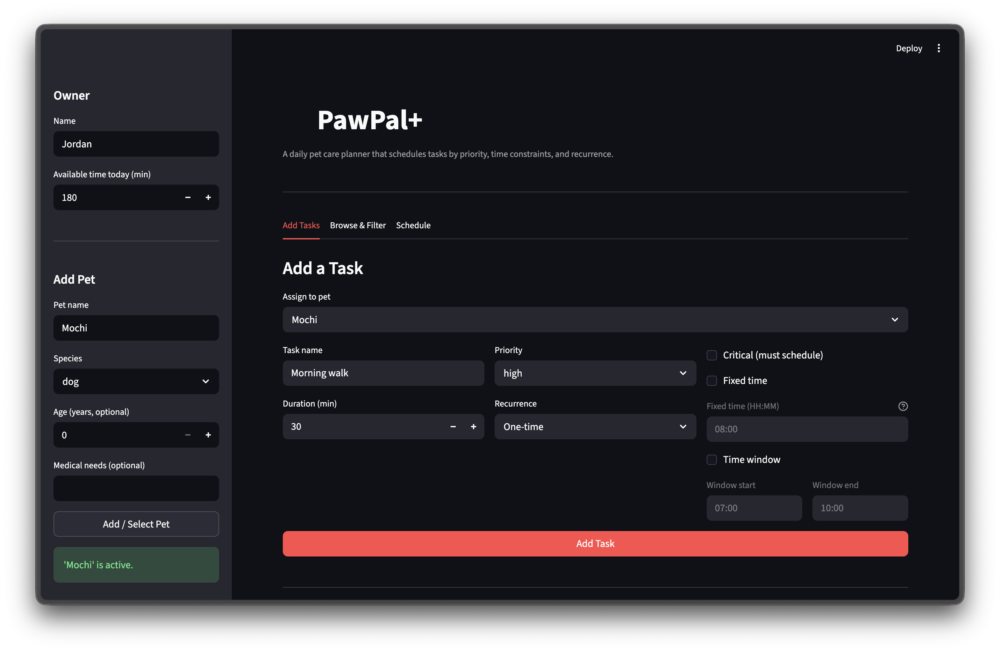
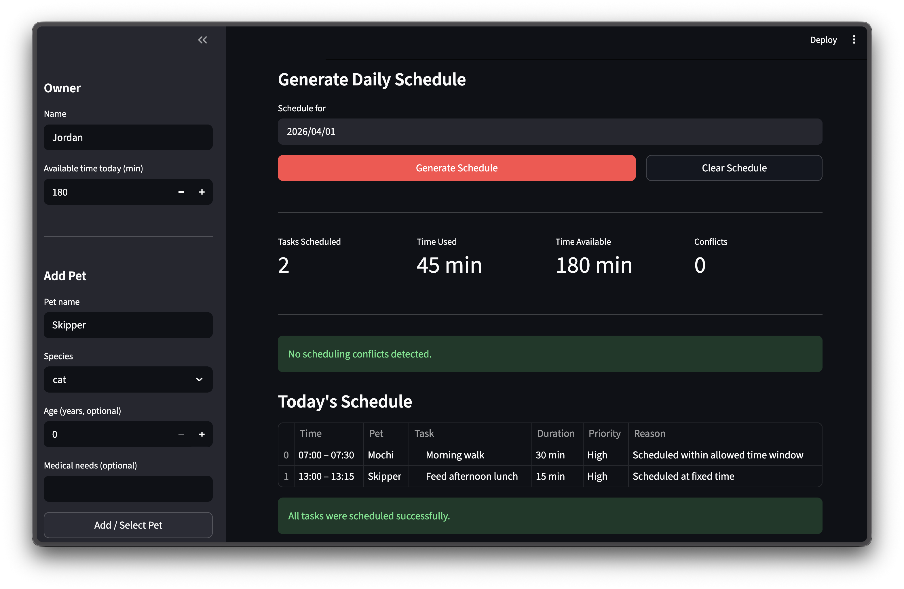
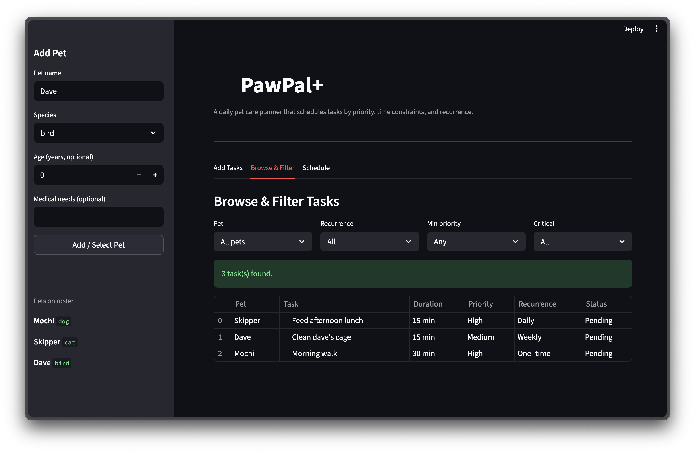
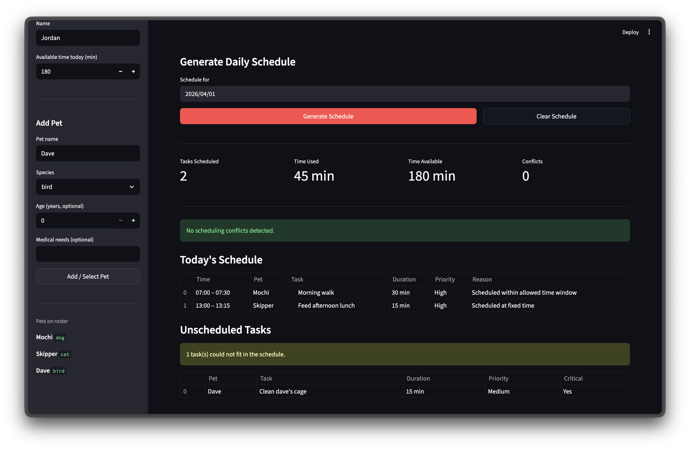

# PawPal+

**PawPal+** is a daily pet care scheduling app built with Streamlit. It helps a pet owner plan care tasks across multiple pets, respecting time budgets, fixed appointments, priority levels, and recurring routines — and explains every scheduling decision it makes.

## Features

### Multi-pet task management
Add any number of pets and assign care tasks to each one. Tasks carry a name, duration, priority (1–5), optional fixed time, optional time window, recurrence rule, and a critical flag.

### Priority-based sorting — `sort_by_time`
Tasks are ordered using a four-level sort before scheduling:
1. **Fixed-time tasks first** — sorted by their exact start minute so appointments are never moved.
2. **Critical tasks next** — flagged tasks (e.g., medication) are elevated above non-critical ones at the same priority.
3. **Higher priority wins** — tasks with a higher priority score are placed before lower-priority ones.
4. **Shorter duration as tiebreaker** — when everything else is equal, shorter tasks are preferred because they are easier to fit into remaining slots.

### Greedy scheduler — `generate_schedule`
The scheduler places tasks one at a time in priority order into the first available time slot. It respects fixed times, time windows, and the owner's total available-time budget. Critical tasks bypass the budget cap so essential care is never silently dropped.

### Advanced filtering — `filter_tasks`
The Browse & Filter tab lets you slice tasks by any combination of pet, recurrence type (one-time, daily, weekly), minimum priority threshold, and critical flag. Results are returned sorted by scheduling priority.

### Recurring task automation — `handle_recurring_tasks` / `advance_recurring_tasks`
Daily and weekly tasks are automatically included in today's schedule when their `next_due_date` is on or before the target date. After completion, `advance_recurring_tasks` moves the due date forward by 1 day (daily) or 7 days (weekly) using `timedelta` and resets the completion flag so the task re-enters tomorrow's schedule without manual input.

### Conflict detection — `detect_conflicts`
After a schedule is generated, the app checks for four categories of problems and surfaces each one as a labelled warning:
- **Overlapping tasks** — reported with the exact number of overlapping minutes.
- **Time window violations** — tasks placed outside their allowed window.
- **Invalid time ranges** — values that are negative, exceed 1440 minutes, or have start ≥ end.
- **Over-scheduling** — total scheduled minutes exceed the owner's available time budget.

The algorithm sorts items by start time first (O(n log n)), then does a single linear scan — each conflict is reported exactly once with no duplicates.

### Unscheduled task reporting — `get_unscheduled_tasks`
Any task that was a candidate for today but could not be placed (due to time budget, window constraints, or slot conflicts) is surfaced in a dedicated section so nothing is silently dropped.

## Getting started

### Setup

```bash
python -m venv .venv
source .venv/bin/activate  # Windows: .venv\Scripts\activate
pip install -r requirements.txt
```

### Run the app

```bash
streamlit run app.py
```

## Testing PawPal+

### Run tests

```bash
python -m pytest tests/ -v
```

### What the tests cover

40 tests across two files:

- **Core behavior** — marking tasks complete, adding tasks to pets
- **Sorting** — schedule output is in chronological order, `sort_by_time` respects the fixed time > critical > priority > duration hierarchy
- **Recurrence** — daily tasks advance by 1 day, weekly by 7, one-time tasks are not rescheduled; future-dated tasks are excluded from today's schedule
- **Conflict detection** — overlapping tasks, tasks outside their time window, invalid time ranges (negative, beyond 1440, start >= end), over-scheduling
- **Edge cases** — midnight boundary (minute 0), end-of-day boundary (minute 1430-1440), tasks that exceed the day are rejected, critical tasks bypass the time budget, zero/negative available time, invalid task names/priority/duration, multi-pet interleaving, back-to-back tasks with no gap

### Confidence level

4/5 stars

The core scheduling logic, sorting, filtering, recurrence, and conflict detection are all well covered and passing. One star held back because the tests don't yet cover every edge case from [notes/edgecases.md](notes/edgecases.md) — specifically tasks with a fixed time that conflicts with their own time window at the scheduler level, and schedules where all tasks are critical and collectively exceed available time.

### Screenshots

<a href="images/01.png" target="_blank"></a>

<a href="images/02.png" target="_blank"></a>

<a href="images/03.png" target="_blank"></a>

<a href="images/04.png" target="_blank"></a>

### My project workflow

- [x] 1. Read the scenario carefully and identify [requirements](notes/requirements.md) and [edge cases](notes/edgecases.md).
- [x] 2. Draft a UML diagram (classes, attributes, methods, relationships).
    - [x] a. List the [building blocks](notes/brainstorm.md) needed for the system
    - [x] b. Actually draft the [UML Diagram](notes/umldiagram.md)
- [x] 3. Convert UML into Python class stubs (no logic yet).
- [x] 4. Implement scheduling logic in small increments.
- [x] 5. Add tests to verify key behaviors.
- [x] 6. Connect your logic to the Streamlit UI in `app.py`.
- [x] 7. Refine [UML Diagram](notes/umldiagram.md) so it matches what you actually built.