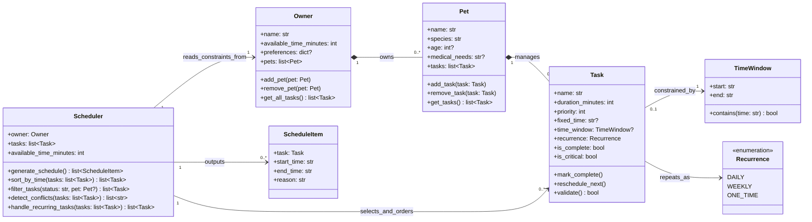

# PawPal+ UML Class Diagram

## Design Notes

- Core entities remain Owner, Pet, Task, and Scheduler.
- TimeWindow, Recurrence, and ScheduleItem are support types that make constraints and output explicit.
- `priority` uses an integer scale (recommended 1-5), with higher values meaning higher priority.
- Optional fields are marked with `?`.
- Composition (`*--`) is used for Owner->Pet and Pet->Task because those objects are managed as part of their parent context.